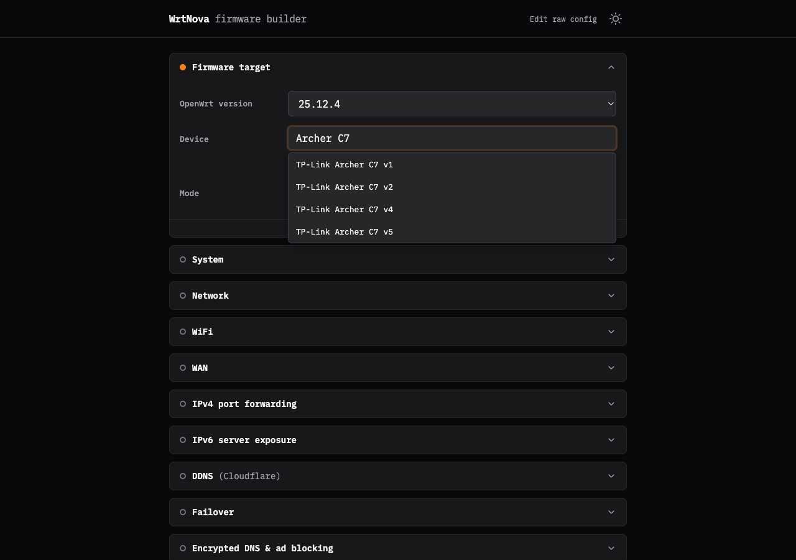
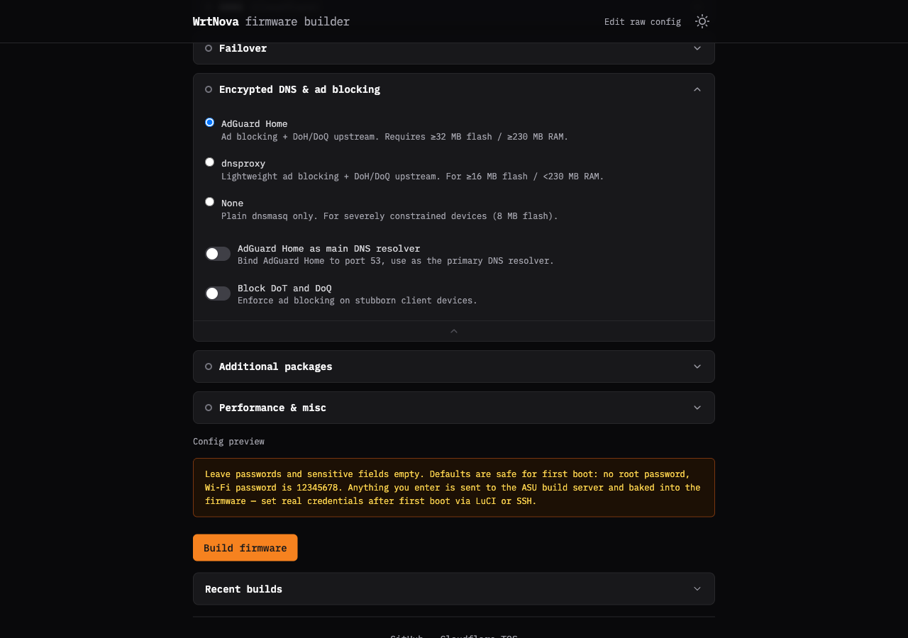
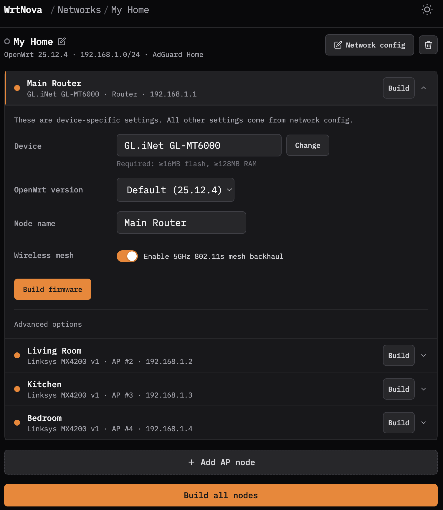

# WrtNova

[](https://github.com/LongQT-sea/wrtnova/actions/workflows/ci.yml)
[](LICENSE)

**Flash your router once, and it is already set up.**

Pick your device, fill in one form, and download a ready-to-flash OpenWrt image
with ad-blocking, a private WireGuard tunnel, guest and IoT isolation, multi-WAN
failover, dynamic DNS, and port forwarding already baked in. No SSH. No command
line. No second device or build server. The router boots configured the way you
want it the first time it powers on.



> ### WrtNova backend never sees your secrets
> Root password, Wi-Fi passphrase, WireGuard keys, API tokens: the entire image is assembled in your browser and sent straight to the OpenWrt build server you choose. They never pass through WrtNova's own backend.

## Why WrtNova

- **One form, a whole router.** Everything OpenWrt usually makes you learn LuCI,
  UCI, and the shell for is here as plain toggles and fields: VLANs, guest/IoT
  isolation, a WireGuard client, multi-WAN failover, DDNS, AdGuard Home, port
  forwarding, IPv6 exposure, and more.
- **It knows real hardware.** Type "Archer C7" and it resolves the exact OpenWrt
  target, profile, and package set for that board, straight from
  `downloads.openwrt.org`.
- **Opinionated and safe by default.** Sensible choices baked in for people who
  just want a router that works, with every one of them adjustable.
- **Build a fleet, not just a box.** Configure a router plus its access points
  once and build firmware for the whole network in one pass.
- **Nothing to install, nothing to trust.** It is a static web app. The build
  runs in your browser; your credentials never touch a backend.

## See it

**Every feature is a toggle, with the tradeoffs spelled out** (and a live config
preview before you build):



**Configure a whole network once and build every node together** - one shared
config, a device and role per node, and a single "Build all nodes" pass for the
router and every access point:



## What it does

WrtNova is a static web app (plus three thin Cloudflare Pages Functions) that
turns the OpenWrt firmware selector into a guided experience. Three pages:

- **[/builder](https://wrtnova.com/builder/)** - single-node guided builder: full config form, live *Config preview*, WARP prefill, build history.
- **[/builder/advanced](https://wrtnova.com/builder/advanced)** - a Monaco editor over the raw wrtnova.sh plus a free-form package list, for people who want to own every line of the generated script.
- **[/networks](https://wrtnova.com/networks/)** - fleet builder: one shared config (the same fields as /builder), per-node device and overrides, and build-all orchestration for a router + access points.

## How it works

The build path runs **entirely in your browser** - WrtNova runs no build server
of its own.

1. The browser fetches the OpenWrt version list and per-device profile data
   directly from `downloads.openwrt.org`.
2. It resolves the final package list locally.
3. It fetches `/wrtnova.sh`, slices off the static body at a section marker,
   prepends its locally rendered config block (including secrets), and POSTs
   the assembled script as the `defaults` field to the OpenWrt ASU build
   server, then polls ASU for the image link.

## Quick start (local dev)

Requires Node 22+.

```sh
npm install
npm run build:css     # Tailwind -> public/style.css
npm run embed         # copy wrtnova.sh -> public/wrtnova.sh
npx wrangler pages dev public
```

`wrangler.toml` already sets `compatibility_flags = ["nodejs_compat"]`, which
the WARP keygen needs. Open the printed localhost URL and you have the full app.

## Deploy your own (Cloudflare Pages)

Point Cloudflare Pages at a fork of this repo. Build settings:

- Build command: `npm run build:css && npm run embed`
- Build output directory: `public`
- `compatibility_flags`: `nodejs_compat` (already in `wrangler.toml`)

Environment variables (Pages dashboard -> Settings -> Variables):

| Var | Required | Purpose |
| --- | --- | --- |
| `ALLOWED_ORIGIN` | no | Comma-separated CORS origin allow-list; `*` matches one subdomain label. Defaults cover the project's own domains. |
| `ASU_URL` | no | Primary ASU build endpoint. Defaults to the official OpenWrt ASU if unset. |
| `ASU_URL_2`, `ASU_URL_3`, ... | no | Additional ASU endpoints shown in the builder dropdown. |

WARP prefill (`/api/warp/register`) is optional and requires a self-hosted
proxy backend that you provide; without it the feature is simply unused and the
rest of the app works normally.

## Project layout

```
public/            Cloudflare Pages output (HTML, CSS, JS modules, fonts)
  builder/         /builder and /builder/advanced
  networks/        /networks
  js/              shared ES modules (.mjs) + UI modules
functions/api/     Cloudflare Pages Functions (session, asu-servers, warp)
scripts/           embed step + CI gate scripts
test/              node:test unit tests
src/style.css      Tailwind input
```

See [SPEC.md](docs/SPEC.md) for the full repository map and design.

## Testing and CI

```sh
npm run ci
```

Runs the type check (`tsc --checkJs`), the unit tests (`node --test`), and the
four invariant gates (no `'0'` off-state emission, section-marker integrity,
single-definition shared functions, CSS/JS byte budgets). CI runs the same on
Node 22.

## Contributing

Contributions welcome. This codebase has a few strong, non-obvious invariants -
please read [CONTRIBUTING.md](.github/CONTRIBUTING.md) before opening a PR.

## License

MIT - see [LICENSE](LICENSE). Bundled third-party assets and their licenses are
listed in [THIRD_PARTY_LICENSES.md](THIRD_PARTY_LICENSES.md).
